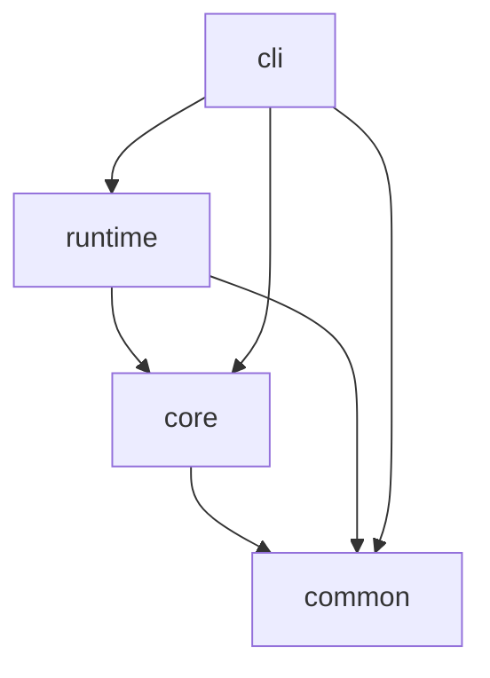
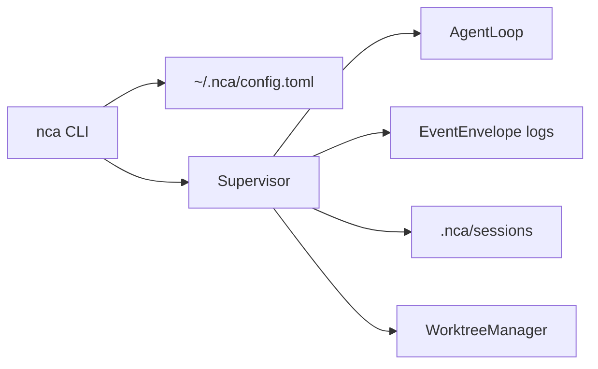
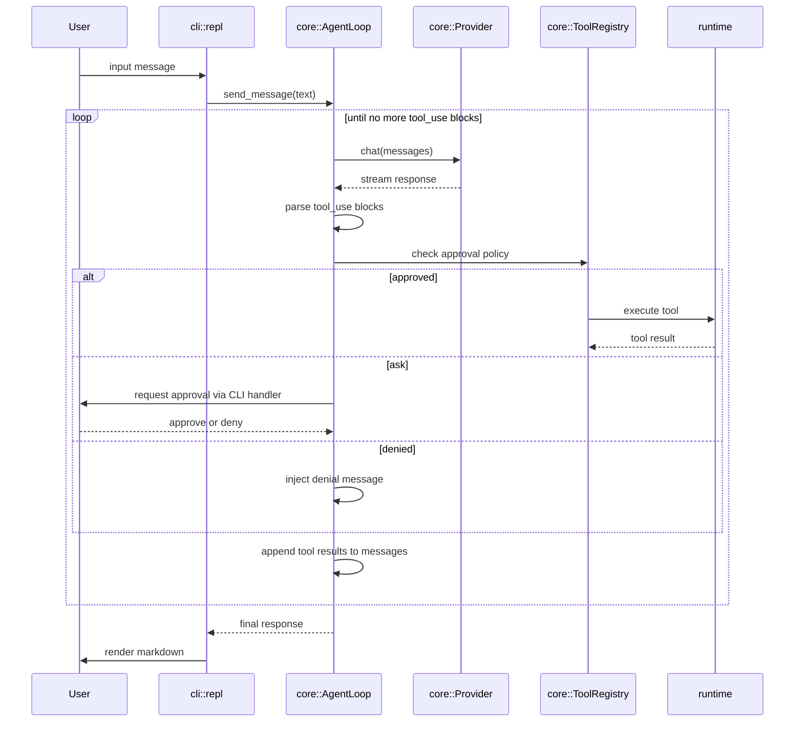
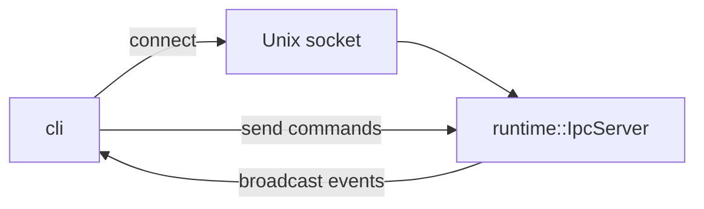
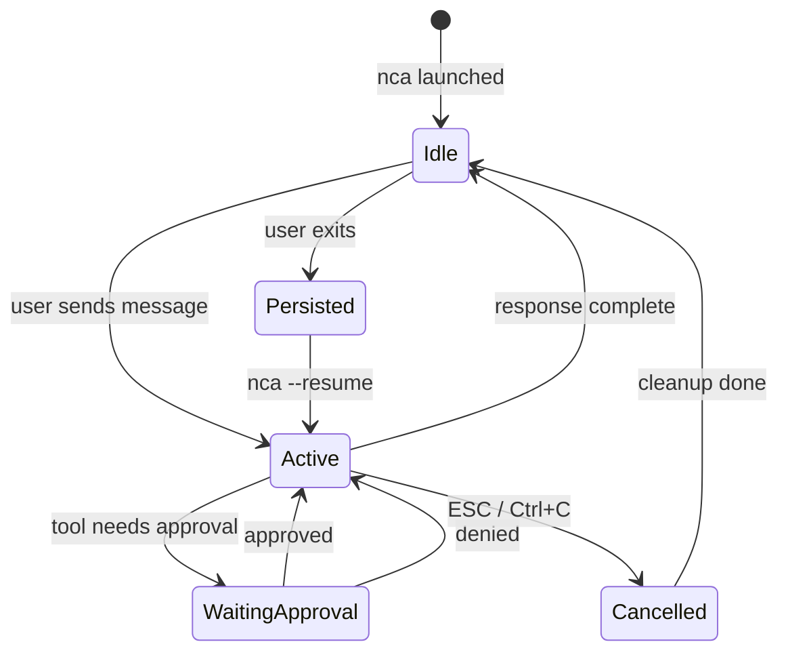

# Architecture

This document defines the crate boundaries, data flows, IPC model, security model, and session lifecycle for nca.

---

## Workspace Layout

```
native-cli-ai/
├── Cargo.toml              # workspace root
├── crates/
│   ├── common/             # shared types, config, event schema
│   │   ├── Cargo.toml
│   │   └── src/
│   │       ├── lib.rs
│   │       ├── config.rs       # NcaConfig, ModelConfig, PermissionConfig
│   │       ├── event.rs        # AgentEvent enum (tool calls, responses, approvals)
│   │       ├── message.rs      # Conversation message types
│   │       ├── tool.rs         # ToolDefinition, ToolCall, ToolResult
│   │       └── session.rs      # SessionMeta, SessionState
│   │
│   ├── core/               # agent loop, provider abstraction, tool protocol
│   │   ├── Cargo.toml
│   │   └── src/
│   │       ├── lib.rs
│   │       ├── agent.rs        # AgentLoop: drives conversation + tool execution
│   │       ├── provider.rs     # Provider trait + provider modules
│   │       ├── provider/
│   │       │   ├── factory.rs  # Selects the configured provider adapter
│   │       │   └── minimax.rs  # MiniMax native API adapter (default)
│   │       ├── code_intel.rs   # Fast-local facade + future language-server mode
│   │       ├── harness.rs      # Layered system prompt builder
│   │       ├── tools/
│   │       │   ├── mod.rs      # ToolRegistry
│   │       │   ├── filesystem.rs
│   │       │   ├── bash.rs
│   │       │   ├── search.rs
│   │       │   ├── web_search.rs
│   │       │   ├── fetch_url.rs
│   │       │   ├── apply_patch.rs
│   │       │   ├── edit_file.rs
│   │       │   └── ... other path/validation tools
│   │       ├── approval.rs     # ApprovalPolicy: allowed / ask / denied
│   │       └── cost.rs         # Token counting and cost estimation
│   │
│   ├── runtime/            # PTY, process management, IPC, tmux
│   │   ├── Cargo.toml
│   │   └── src/
│   │       ├── lib.rs
│   │       ├── pty.rs          # PtyManager: spawn, read, write, resize
│   │       ├── process.rs      # SandboxedProcess: workspace-confined execution
│   │       ├── ipc.rs          # IpcServer / IpcClient over Unix socket
│   │       ├── tmux.rs         # TmuxAdapter (Phase 3)
│   │       └── session_store.rs # Persist / load sessions to disk
│   │
│   ├── cli/                # TUI shell, run/spawn control plane, streaming
│   │   ├── Cargo.toml
│   │   └── src/
│   │       ├── main.rs         # Entrypoint, clap args, launch
│   │       ├── app.rs          # App state machine
│   │       ├── repl.rs         # REPL loop: input -> agent -> render
│   │       ├── runner.rs       # Session runtime builder / persistence glue
│   │       ├── stream.rs       # Human and NDJSON event rendering
│   │       ├── render/
│   │       │   ├── mod.rs
│   │       │   ├── markdown.rs # Markdown-to-terminal rendering
│   │       │   ├── diff.rs     # Colored diff display
│   │       │   └── status.rs   # Cost bar, model info, mode indicator
│   │       └── prompt.rs       # reedline-based input with completions
│
├── docs/
│   ├── prd.md
│   ├── tech-stack.md
│   └── architecture.md     # this file
│
└── .cursor/
    └── rules/              # Cursor rules for AI-assisted development
```

---

## Crate Dependency Graph



The CLI delegates session lifecycle to the runtime `Supervisor`.

## CLI-first architecture

The terminal app (`nca`) is the primary interface. Session state and optional `NCA_ORCH_*` metadata stay local-first; use `nca` with JSON/NDJSON flags for automation.



### Key modules

- **`runtime::supervisor`**: Session lifecycle manager used by the CLI (`nca serve`, attach, spawn, etc.).
- **`runtime::session_store`**: Persist and load session JSON under `<workspace>/.nca/sessions/`.
- **`runtime::worktree`**: Isolated git worktree creation, cleanup, and merge per agent run.
- **`runtime::bash_tool`**: PTY-backed bash execution, registered by the supervisor.

---

## Agent Loop

The central execution model is a **tool-use loop** driven by `core::agent::AgentLoop`.

The current default provider path is `MiniMaxProvider`, selected by `core::provider::factory`
from `common::config::NcaConfig`. The CLI resolves configuration from defaults, `~/.nca/config.toml`,
`.nca/config.local.toml`, and environment variables such as `MINIMAX_API_KEY`.

The system prompt is layered by `core::harness::build_system_prompt`:

1. built-in harness prompt
2. project instructions from `.ncarc`
3. local instructions from `.nca/instructions.md`
4. optional orchestration metadata from `NCA_ORCH_*`



### Streaming

Provider responses are streamed token-by-token via `tokio::sync::mpsc` using MiniMax SSE. The CLI can render:

- human-readable live progress
- NDJSON `EventEnvelope` stream mode
- no stream, with only final output

Tool-use blocks are collected, executed by the registry, and replayed to MiniMax as `tool` messages until a final assistant response is produced.

### Search and edit flow

The default local search/edit loop is intentionally lightweight and Rust-native:

- `core::tools::search::SearchCodeTool` shells out to `rg --json` and returns structured JSON matches with file path, line, column, matched text, and optional context lines.
- `core::code_intel::FastLocalCodeIntel` provides fast Rust symbol lookup via literal-name search instead of passing raw user regex into symbol patterns.
- `core::tools::edit_file::EditFileTool` and `core::tools::apply_patch::ApplyPatchTool` still perform exact string replacement, but now reject ambiguous single-match edits and require `replace_all` or a more precise targeting flow.
- `core::tools::replace_match::ReplaceMatchTool` is the bridge between search and editing: it replaces a specific match at exact `path`, `line`, and `column` coordinates.

This keeps the current architecture simple: ripgrep remains the matcher, while the tool contract becomes structured enough for safer agent behavior without introducing a full local search index yet.

---

## IPC and Event Bus

The runtime exposes a Unix domain socket at `$XDG_RUNTIME_DIR/nca/<session-id>.sock` (or `/tmp/nca/` as fallback). Running sessions persist status, PID, and socket path in session metadata.

### Protocol

- **Transport**: Unix stream socket, newline-delimited JSON.
- **Direction**: The runtime is the server. The CLI (e.g. `nca attach`) connects as a client.
- **Messages**: Every `AgentEvent` from `common::event` is wrapped in `EventEnvelope` and serialized to all connected clients. Persisted logs and live IPC use the same machine-readable shape.



### Event Schema (common::event)

```rust
pub enum AgentEvent {
    SessionStarted { session_id: String, workspace: PathBuf, model: String },
    MessageReceived { role: Role, content: String },
    TokensStreamed { delta: String },
    ToolCallStarted { call_id: String, tool: String, input: serde_json::Value },
    ToolCallCompleted { call_id: String, output: ToolResult },
    ApprovalRequested { call_id: String, tool: String, description: String },
    ApprovalResolved { call_id: String, approved: bool },
    CostUpdated { input_tokens: u64, output_tokens: u64, estimated_cost_usd: f64 },
    Checkpoint { phase: String, detail: String, turn: u32 },
    SessionEnded { reason: EndReason },
    Error { message: String },
    Response { response: AgentResponse },
    ChildSessionSpawned { parent_session_id: String, child_session_id: String, task: String, workspace: PathBuf, branch: Option<String> },
    ChildSessionCompleted { parent_session_id: String, child_session_id: String, status: String },
    QuestionRequested { question: InteractiveQuestionPayload },
    QuestionResolved { question_id: String, selection: QuestionSelection },
}
```

`InteractiveQuestionPayload` carries `question_id`, `call_id`, `prompt`, `options` (`id` + `label`), `allow_custom`, and `suggested_answer` (always present for fast accept). `QuestionSelection` is an internal tagged enum: `suggested`, `option { option_id }`, or `custom { text }`.

### Command Schema

```rust
pub enum AgentCommand {
    SendMessage { content: String },
    ApproveToolCall { call_id: String },
    DenyToolCall { call_id: String },
    AnswerQuestion { question_id: String, selection: QuestionSelection },
    Cancel,
    Shutdown,
}
```

---

## PTY and Process Execution

### Sandboxed Bash

`runtime::pty::PtyManager` wraps command execution to:

1. Spawn a shell in a PTY confined to the workspace root (via `chdir`).
2. Capture stdout/stderr as structured output.
3. Enforce a timeout (default 30s, configurable).
4. Kill the process on cancellation or timeout.

### Permission Check Flow

```
User request -> Agent proposes bash tool call
  -> core::approval checks command against config tiers:
     allowed_commands: ["cargo", "npm", "go", "ls", "cat", "grep", "git status", ...]
     denied_commands:  ["rm", "sudo", "chmod", "kill", "shutdown", ...]
     ask_commands:     [everything else]
  -> If "ask": prompt through the active approval handler
  -> If approved: runtime-backed bash executor runs command in workspace
  -> Result streamed back as ToolResult
```

## Session Commands

The CLI now exposes multiple session surfaces on top of the same engine:

- `run` for explicit one-shot execution
- `--run` for Claude-style interactive run mode
- `serve` for long-lived IPC-controlled sessions
- `spawn` for background execution
- `sessions` for saved-session listing
- `resume` for continuing a saved session
- `logs` for replaying structured event output
- `attach` for live event replay over IPC
- `status` for session metadata
- `cancel` for stopping a running session

## Permission Modes

The CLI supports explicit permission handling modes:

- `default` for read/web tools auto-allowed, edits and commands ask
- `plan` for analysis/research only
- `accept-edits` for auto-accepted file edits with command caution
- `dont-ask` for readonly-only automatic execution
- `bypass-permissions` for fully trusted environments

---

## Tmux Adapter (Phase 3)

`runtime::tmux::TmuxAdapter` wraps `tmux_interface` behind a trait:

```rust
#[async_trait]
pub trait MultiplexerAdapter: Send + Sync {
    async fn create_session(&self, name: &str, cwd: &Path) -> Result<SessionHandle>;
    async fn attach(&self, handle: &SessionHandle) -> Result<()>;
    async fn detach(&self, handle: &SessionHandle) -> Result<()>;
    async fn send_keys(&self, handle: &SessionHandle, keys: &str) -> Result<()>;
    async fn capture_pane(&self, handle: &SessionHandle) -> Result<String>;
    async fn kill_session(&self, handle: &SessionHandle) -> Result<()>;
}
```

This trait allows swapping tmux for zellij or a built-in multiplexer later.

---

## Session Model

### Persistence

Sessions are stored as JSON files in `.nca/sessions/<session-id>.json`:

```json
{
  "id": "a1b2c3",
  "created_at": "2026-03-11T10:00:00Z",
  "updated_at": "2026-03-11T10:15:00Z",
  "workspace": "/home/user/project",
  "model": "claude-sonnet-4-5",
  "messages": [ ... ],
  "total_input_tokens": 12500,
  "total_output_tokens": 8300,
  "estimated_cost_usd": 0.042
}
```

Persistence is workspace-local:

- `<workspace>/.nca/sessions/*.json` stores session snapshots and conversation state.
- `<workspace>/.nca/sessions/*.events.jsonl` stores append-only event streams for replay and live attach.

### Lifecycle



---

## Security Model

### Workspace Sandbox

```
workspace_root/
├── .nca/                    # nca data (sessions, config, instructions)
│   ├── config.local.toml    # gitignored, local overrides
│   ├── instructions.md      # personal instructions
│   └── sessions/
├── .ncarc                   # project-wide instructions (version controlled)
├── src/                     # project source -- full read/write access
└── ...
```

- **Inside workspace**: Read and write allowed by default.
- **Outside workspace**: Read only if explicitly allowed in config. Write always denied.
- **Home directory config**: `~/.nca/config.toml` for global defaults.

### Threat Model

| Threat | Mitigation |
|--------|-----------|
| LLM instructs destructive command | Tiered approval system; destructive commands in deny list |
| LLM writes outside workspace | Path canonicalization + workspace root check before every write |
| LLM exfiltrates secrets via bash | Bash runs in PTY with no inherited env vars beyond explicit allowlist |
| Malicious MCP server | MCP server commands are not covered by workspace sandbox; documented as user responsibility |
| Session file tampering | Sessions are local-only; no remote sync in MVP |

---

## Config Resolution Order

Config values are resolved with later sources overriding earlier ones:

1. Compiled defaults
2. `~/.nca/config.toml` (global)
3. `.nca/config.local.toml` (workspace, gitignored)
4. Environment variables (`NCA_API_KEY`, `NCA_MODEL`, etc.)
5. CLI flags (`--model`, `--safe`, `--verbose`)

---

## Performance Design Principles

See [research/rust-ratatui-optimization.md](./research/rust-ratatui-optimization.md) for detailed analysis and benchmarks.

### Key Optimization Patterns

**Dirty Flag Rendering**: Ratatui's default behavior redraws at 60 FPS even for static content, causing 7%+ CPU usage in release builds. The solution is event-driven rendering:

```rust
// Only render when state actually changes
if app.is_dirty() {
    terminal.draw(|f| app.render(f));
    app.clear_dirty();
}
```

**Bounded Channels for Backpressure**: Unbounded IPC channels can accumulate infinite messages during load spikes. Use bounded channels to create natural backpressure:

```rust
// Bounded channel: sender blocks when buffer full
let (tx, rx) = tokio::sync::mpsc::channel(100);
```

**Preallocate Collections**: Vec growth involves heap allocation. Preallocate when size is known:

```rust
let mut rows = Vec::with_capacity(width);
for _ in 0..width {
    rows.push(Row::with_capacity(height));
}
```

### Binary Size Optimization

Release builds should use aggressive size optimization:

```toml
[profile.release]
opt-level = "z"        # Optimize for size
lto = true             # Link-time optimization
codegen-units = 1      # Single unit for max optimization
strip = true           # Remove symbols
panic = "abort"         # Smaller panic handling
```

**Expected impact**: 40-50% binary size reduction vs default release build.

### Performance Targets

| Metric | Target | Reference |
|--------|--------|-----------|
| Idle CPU | <1% | Ratatui issue #1338 shows 7% baseline |
| Active typing CPU | <5% | Per-char renders should be minimal |
| Binary size | <5 MB | Current measurement needed |
| Cold start | <100ms | |

---

## Build and Distribution

- **Dev**: `cargo run -p nca-cli`
- **Release**: `cargo build --release` produces `nca` (CLI).
- **Size-optimized**: `cargo build --profile release-opt-size` (uses `release-opt-size` profile if defined).
- **Install**: `cargo install --path crates/cli`.
- **CI**: GitHub Actions with `cargo test --workspace`, `cargo clippy --workspace`, `cargo fmt --check`.
- **Cross-compile**: Target `x86_64-unknown-linux-musl` for static Linux binaries. macOS and Windows use default targets.
